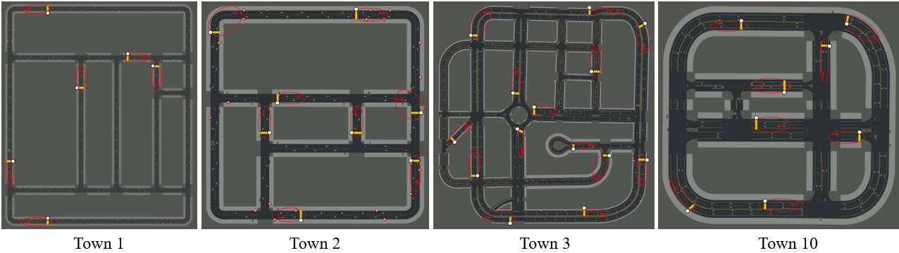
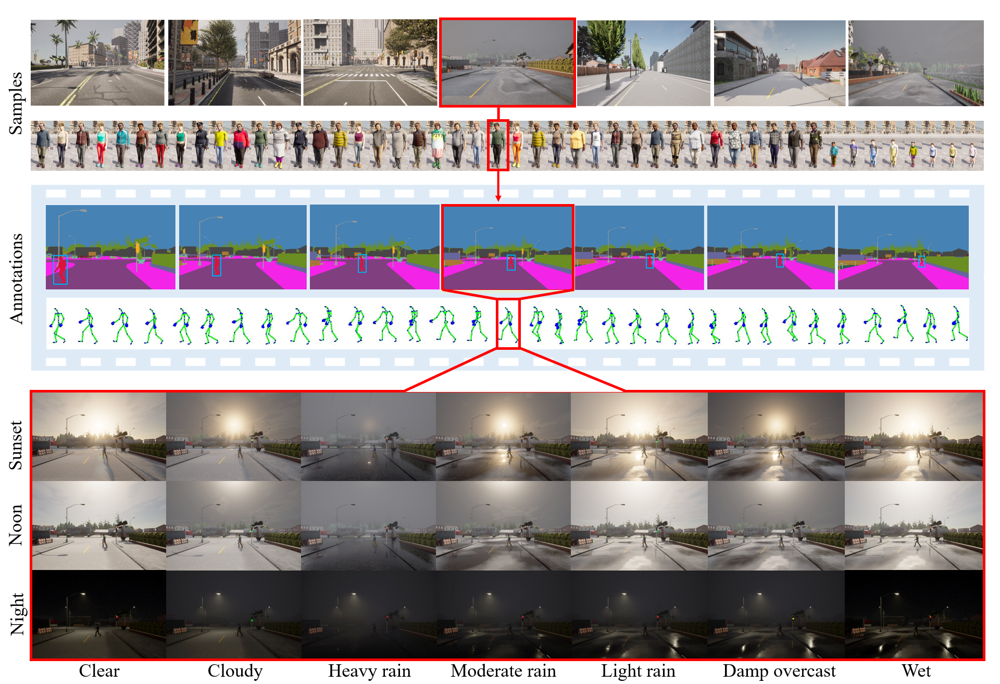

# SyntheticCrossing
Generating Synthetic Pedestrian Crossing Scenarios with randomised parameters including weather and lighting conditions.    

## Synthetic Data Generation

This dataset was generated to **train Object Semantic Segmentation (OSS) and Body Pose Estimation (BPE) models** as spatial feature extractors for downstream pedestrian crossing prediction. These models work at the **frame level**, so temporally realistic pedestrian behaviour is **not required**. The final crossing prediction models are trained on **real-world datasets** to learn temporal cues and intention dynamics.

### Simulation Environment

Data was generated using **[CARLA](https://carla.org/)**, an open-source urban driving simulator. While hyper-realistic simulation environments may offer detailed textures, CARLA provides an effective **balance between visual diversity and structural control**, making it ideal for domain randomisation and reproducible spatial modelling.

### Scenarios & Pedestrians

- **36 unique driving scenarios** across various urban layouts:
  - 16 intersections, 10 straight roads, 6 curved roads, 4 roundabouts
- **48 pedestrian avatars** with varied body shapes, ages, and clothing styles
- Pedestrian movement is precisely scripted using 3D waypoints to control:
  - **Crossing direction** (left-to-right or right-to-left)
  - **Waiting time before crossing** (0–4 seconds)
  - **Walking speed** (walking or running)
- Vehicle behaviour is controlled by CARLA’s autopilot for consistency and safety
- Ego-vehicle speed: Randomly selected between **15–30 mph**
- Initial pedestrian distance: Randomly selected between **20–30 meters** from the ego vehicle

---

### 🗺️ Simulated Scenario Locations

The simulated scenarios in the CARLA environment were collected from the towns illustrated in the figure below:

- **Town 1**: A small town with numerous T-junctions, a variety of buildings, coniferous trees, and small bridges spanning a river  
- **Town 2**: A small town with T-junctions, a mix of residential and commercial areas, and patches of trees  
- **Town 3**: A larger town featuring a downtown urban area with road network elements like roundabouts, underpasses, and overpasses  
- **Town 10**: An alternate view of Town 3, highlighting its complex structure and ongoing construction zones  

  
*The direction of the ego vehicle is represented by the red arrow, the pedestrian is indicated by white circles, and the crossing path is illustrated by the yellow line.*

### Domain Randomisation

Each scenario is repeated **21 times**, combining:
- **3 lighting conditions**: night, noon, sunset
- **7 weather conditions**: clear, cloudy, damp, wet, light rain, moderate rain, heavy rain

This results in **648 variations** simulating diverse urban conditions, enhancing robustness in visual feature extraction.

  
*A sample simulated pedestrian crossing scenario under various lighting and weather conditions.*

### Data Collection

- **Resolution**: 1920×1080 RGB frames
- **Frame rate**: 2 FPS for ~10 seconds per scenario
- **Ground-truth annotations**:
  - **2D pose keypoints**: 17 body joints per pedestrian (subset of CARLA's 67-point skeleton)
  - **Semantic segmentation masks** for:
    - pedestrians, roads, sidewalks, cars, buses, trucks, buildings, sky, traffic signs/lights, poles

### Summary

- **Total scenarios**: 648  
- **Total annotated semantic frames**: 15,120  
- **Total pedestrian frames with joint keypoints**: 725,760  

